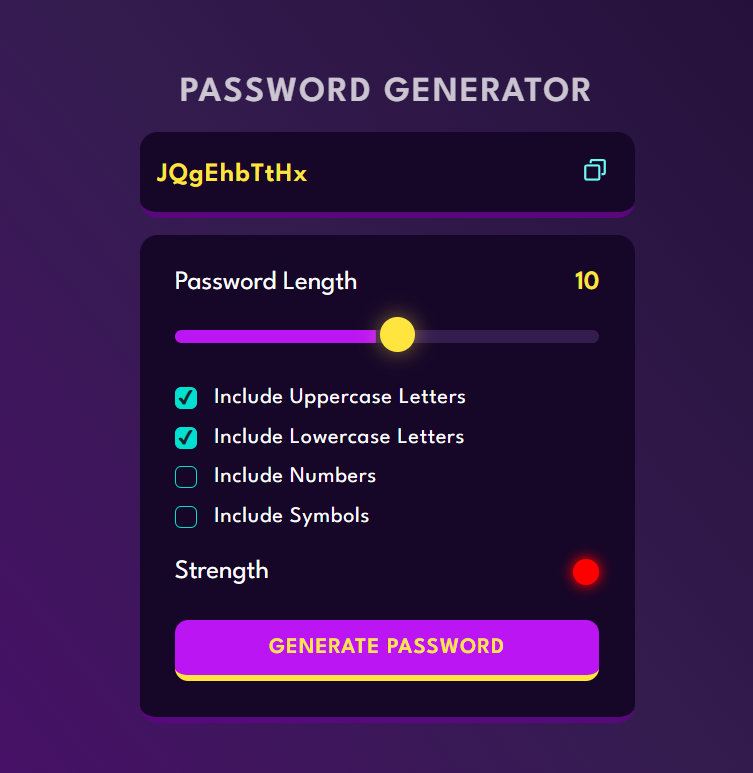

# Password Generator 🔐

A sleek, modern password generator web application with customizable options and a real-time strength indicator.  
Built with **HTML**, **CSS**, and **JavaScript** for a responsive and visually appealing design.

## 🌐 Live Demo
[🔗 Click here to try it out](keygenx.vercel.app)

## ✨ Features
- **Customizable Length** – Choose password length via slider.  
- **Character Options** – Include:  
  - Uppercase letters  
  - Lowercase letters  
  - Numbers  
  - Symbols  
- **Strength Indicator** – Visual indicator:  
  - 🟥 Red = Weak  
  - 🟨 Yellow = Medium  
  - 🟩 Green = Strong  
- **One-Click Copy** – Instantly copy generated passwords to clipboard.  
- **Responsive Design** – Works smoothly across devices.  

## 📸 Preview
  


## 🚀 How to Use
1. Open the web page.  
2. Adjust **Password Length** with the slider.  
3. Select desired character types.  
4. Click **Generate Password**.  
5. Copy your secure password using the copy button.  

## 🛠️ Built With
- **HTML5** – Structure  
- **CSS3** – Styling and layout  
- **JavaScript (Vanilla)** – Password generation logic & clipboard functionality  

## 📂 Installation & Setup
Clone the repository:

```bash
git clone https://github.com/DevRoh/Password-Generator.git
